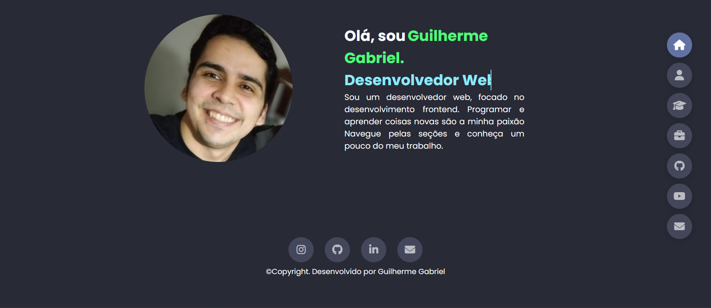

# iUUL - Desafio 1

O objetivo desse projeto foi a realização do primeiro desafio da residência em desenvolvimento de software da [iUUL](https://iuul.com.br/). O projeto foi um site pessoal/portfolio seguindo os requisitos técnicos de projetos estabelecidos.

## Tecnologias utilizadas

- HTML.
- CSS.
- Javascript.

## Preview do projeto

Preview da homepage versão desktop.

<p align="center">
 
</p>

Preview da homepage versão mobile.

<p align="center">
 
</p>

## Como testar o projeto

Digite no seu terminal

```bash

git clone https://github.com/guilhermag/iuul-desafio-1.git

cd iuul-desafio-1/
```

Agora é só abrir o ``index.html``.

Também é possível acessar o projeto [hospedado na Vercel](https://iuul-desafio-1-guilherme.vercel.app/).

## Créditos

Desenvolvido por Guilherme de Araujo Gabriel.
